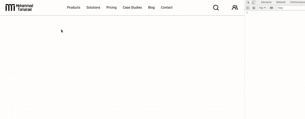
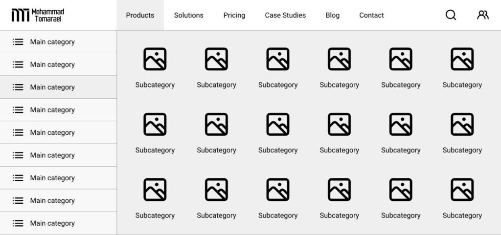
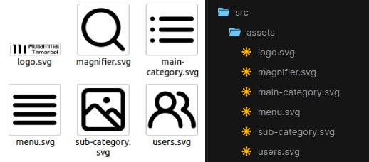
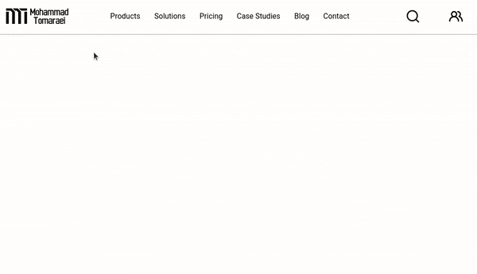
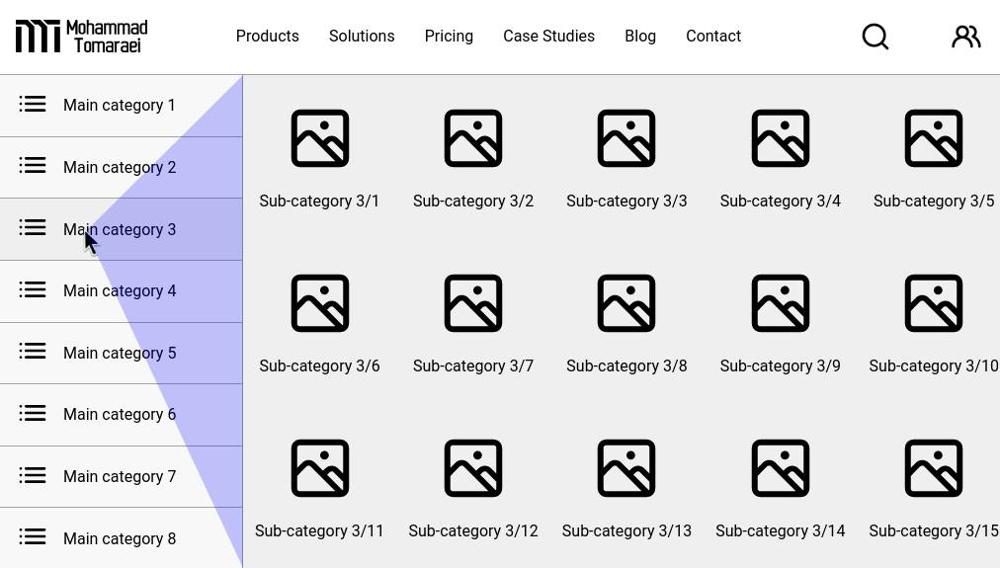
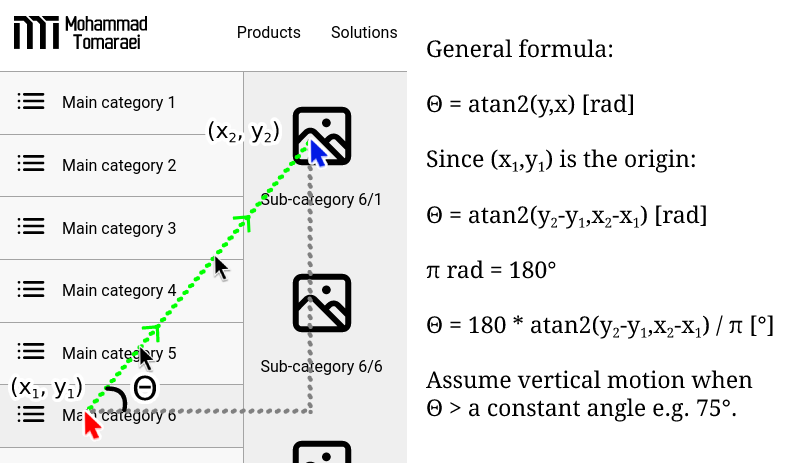
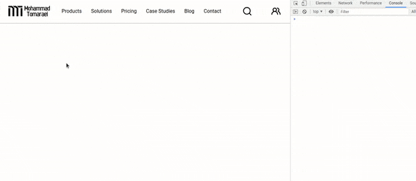
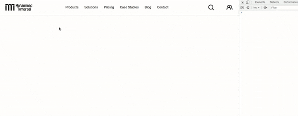

# Smart Mega Menu with Vue.js
For more projects and articles like this, please visit my blog: [Mohammad Tomaraei](https://tomaraei.com)

[](https://tomaraei.com)



## Why would I need a mega menu?

As your website grows and its hierarchy of pages becomes more complex, you may realize that simple horizontal or vertical menus are not optimal for effective user navigation. Similarly, there is the need for a larger space if you wish to improve the user experience by introducing visual cues such as icons and images. A mega menu is an example of a design pattern that could fulfill such demands and helps increase the conversion rate.

Research conducted by the well-known  [Nielsen Norman Group](https://www.nngroup.com/)  confirms the effectiveness of the mega menu design pattern.  [Their analysis](https://www.nngroup.com/articles/mega-menus-work-well/)  of case studies on various high-traffic websites attributed these characteristics to an effective mega menu implementation:

-   spacious navigation panels
-   clearly grouped and labeled with headings
-   following a uniform layout
-   displaying all choices simultaneously to avoid scrolling
-   reactive to hovering, clicking, or tapping
-   arranged either vertically, horizontally, or as a fly-out

Mega menus are suitable for large viewports like tablets and desktops, but a few adjustments could make this design responsive for mobile users as well.

## How to make a mega menu?

The technical implementation of a basic mega menu is relatively easy and can be done just with CSS. However, I will be using Vue.js as the base for this example so we can add more features and make the menu user-friendly.

Let’s create a simple mega menu with a vertical menu on the left for the main categories and a grid layout on the right to display sub-categories along with icons.

## Interface design

Creating a mockup is a great way to kick off a new project. It lets you have the freedom to unleash your creativity without having to worry about technical details — remember, the devil is in the details.

Here is a  [Figma mockup](https://www.figma.com/file/Pfbgci2q6KDjNK5BRAfo6A/Untitled?node-id=1%3A2)  to illustrate what we’re creating:

[](https://www.figma.com/file/Pfbgci2q6KDjNK5BRAfo6A/Untitled?node-id=1%3A2)

## Technical implementation

We can now proceed with the actual implementation of the mega menu by creating a new Vue.js project. You could  [Vue CLI](https://cli.vuejs.org/guide/creating-a-project.html)  to create a new project on your computer, but for simplicity’s sake, I’m opting for an online development environment called  [CodeSandbox](https://codesandbox.io/). It comes with a  [Vue.js template](https://codesandbox.io/s/vue-vue) that you could fork to jump-start your project.

Copy the SVG icons you’d like to use to the  `assets`  folder. If you used an icon library in Figma, you can simply click on each icon and export it to an SVG file.



We will be creating two Vue components:  `NavBar`  for the top navigation bar and  `MegaMenu`  which is the actual mega menu implementation.

## Navigation bar

The navigation bar’s  `template`  section consists of three main  `div`s containing the logo, main menu items, and primary icons. These  `div`s are wrapped in a parent container that uses a  `flex`  display with a  `justify-content`  of  `space-between`  to evenly spread out the three sections. To simplify our code, we can take advantage of Vue.js’s  `v-for`  directive to automatically render the menu items. The  `:hover`  CSS selector is used to highlight the item that the user is interacting with.

We need a way to know exactly which menu item is being hovered. This is required for showing the mega menu for a particular item only or to show different mega menus for different items. We can listen to the  `mouseover`  event by binding it to a component method called  `mouseEvent`. The  `` `mouseEvent` ``  method is triggered by elements of classes  `menu-container`  and  `item`. That is because we need to know when a menu item is being hovered and when the mouse has moved elsewhere on the navigation bar.

We also need to create and import the  `MegaMenu`  component. The  `v-if`  directive is bound to a reactive data variable named  `showMegaMenu`  which is activated when the user hovers the  _Products_  menu item.

**Note:**  Please refer to the GitHub repository for the complete code which includes the  `style`  section with the CSS.

```html
<template>
  <div>
    <div class="menu-container" @mouseover="mouseEvent($event, 'wrapper')">
      <div class="logo">
        <a href="https://tomaraei.com">
          
        </a>
      </div>
      <div class="items">
        <a
          v-for="item in menuItems"
          @mouseover="mouseEvent($event, 'item', item.key)"
          :key="item.key"
          class="item"
        >
          {{ item.label }}
        </a>
      </div>
      <div class="icons">
        <div class="icon">
          
        </div>
        <div class="icon">
          
        </div>
        <div class="icon menu">
          
        </div>
      </div>
    </div>
    <MegaMenu v-if="showMegaMenu" />
    <div class="viewport-warning">
      <div class="message">
        This example was made for viewport sizes 920px and above :)
      </div>
    </div>
  </div>
</template>
```

In the  `script`  section below you can find the implementation of the  `mouseEvent`  method. Note that we are supplying a  `source`  argument to this method to help us differentiate whether the call is originating from the parent wrapper or an actual menu item. This is necessary to prevent a phenomenon known as  [event bubbling](https://stackoverflow.com/questions/4616694/what-is-event-bubbling-and-capturing), in which two events are triggered when a mouse event is set for two elements in a parent-child structure. Calling the  `stopPropagation`  method prevents cascading of further events.

The  `NavBar`  component is responsible for showing and hiding the  `MegaMenu`  component. This is easy to handle and it is taken care of by the  `mouseEvent`  method to toggle the  `showMegaMenu`  data variable. However, we still need to know when the user has moved the mouse outside the mega menu to hide it as well. To achieve this, we need a way to send a signal from one component to another. This is where the idea of an  [event bus](https://css-tricks.com/lets-create-a-lightweight-native-event-bus-in-javascript)  comes into the picture. Vue has a special feature for  [emitting custom events](https://vuejs.org/v2/guide/components-custom-events.html). The only prerequisite for that is a common Vue instance that both components can refer to. Create a JavaScript file named  `eventBus.js`  and import it in the script section of both components.

```js
// eventBus.js
import Vue from "vue";
const eventBus = new Vue();

export default eventBus;
```

For a component to receive events, it must explicitly listen to a particular event name. This can be done by calling the  `$on`  and  `$off`  custom event methods in the  `mounted`  and  `beforeDestroy`  [lifecycle hooks](https://vuejs.org/v2/api/#Options-Lifecycle-Hooks)  respectively. In our example, a  `hide-mega-menu`  event will set the  `showMegaMenu`  to  `false`  when triggered.

```js
<script>
import MegaMenu from "./MegaMenu";
import eventBus from "../eventBus";

export default {
  name: "NavBar",
  components: {
    MegaMenu,
  },
  data() {
    return {
      menuItems: [
        { key: "products", label: "Products" },
        { key: "solutions", label: "Solutions" },
        { key: "pricing", label: "Pricing" },
        { key: "case-studies", label: "Case Studies" },
        { key: "blog", label: "Blog" },
        { key: "contact", label: "Contact" },
      ],
      showMegaMenu: false,
    };
  },
  methods: {
    mouseEvent(event, source, key = "") {
      if (source === "item") {
        event.stopPropagation();
      }
      this.showMegaMenu = key === "products";
    },
  },
  mounted() {
    eventBus.$on("hide-mega-menu", () => {
      this.showMegaMenu = false;
    });
  },
  beforeDestroy() {
    eventBus.$off("hide-mega-menu");
  },
};
</script>
```

## Mega menu

We have now laid the foundation for this project. Hovering the  _Products_  menu item should toggle the mega menu component. The  `template`  section of the  `MegaMenu`  component is made up of two side-by-side  `div`s representing a vertical list of main categories on the left and a square grid of sub-categories with images on the right. We’re using a  `grid`  display to achieve a ratio of 1 to 3 for these two  `div`s. There is a handy  [online tool for generating CSS grids](https://grid.layoutit.com/)  that comes with an intuitive interface and visualization to quickly configure your desired layout.

[](https://grid.layoutit.com/)

The main and sub-category items are generated using the  `v-if`  directive for simplicity, but in a real-life project this would be connected to an API to retrieve the actual product categories. If you’re going that route, I recommend making your API calls using Vue’s state management pattern known as  [Vuex](https://vuex.vuejs.org/).

Similar to the navigation bar component, we are also using the  `mouseover`  event to identify the active main category. In this case, however, we’re using  [Vue’s dynamic class binding](https://vuejs.org/v2/guide/class-and-style.html)  (`:class`) to toggle an  `active`  class on the main category item. This couldn’t be accomplished using CSS’s  `:hover`  selector, as we wouldn’t be able to keep the main category highlighted after the user has moved the mouse to select a sub-category. Sub-categories themselves are still using the  `:hover`  CSS selector.

```html
<template>
  <div @mouseleave="hideMegaMenu()" class="megamenu-wrapper">
    <div class="main-categories">
      <div
        v-for="index in 8"
        :key="index"
        @mouseover="activeMainCategory = index"
        :class="['main-category', isActive(index) ? 'active' : '']"
      >
        <div class="icon"></div>
        <div class="label">Main category {{ index }}</div>
      </div>
    </div>
    <div class="sub-categories">
      <div v-for="index in 15" :key="index" class="sub-category">
        <div class="icon"></div>
        <div class="label">
          Sub-category {{ activeMainCategory }}/{{ index }}
        </div>
      </div>
    </div>
  </div>
</template>
```

The  `script`  section is rather simple. It imports the  `eventBus`  and emits the  `hide-mega-menu`  event whenever the mouse leaves the mega menu, so that the  `NavBar`component could hide it. The active main category is determined by storing its index number in a data variable called  `activeMainCategory`.

```js
<script>
import eventBus from "../eventBus";

export default {
  name: "MegaMenu",
  data() {
    return {
      activeMainCategory: 1,
    };
  },
  methods: {
    hideMegaMenu() {
      eventBus.$emit("hide-mega-menu");
    },
    isActive(key) {
      return this.activeMainCategory === key;
    },
  },
};
</script>
```

We now have a functioning mega menu that should work just fine.

Here’s a preview of how it looks like:



## But wait, didn’t you say it’s a smart mega menu?

A pleasant user experience (UX) requires the developers to pay attention to little details. These tiny improvements can collectively make a design smarter. One such example is when the user hovers on a main category and then navigates to the right to choose a sub-category. Depending on where the cursor is, the user may accidentally select another main category, which could be quite annoying. This is what I mean:


Even though it seems like a minor thing, there have been many articles written on this exact issue! For instance, Ben Kamens published  [a blog post](https://bjk5.com/post/44698559168/breaking-down-amazons-mega-dropdown)  analyzing how Amazon avoided this problem by using trigonometry. An imaginary triangle is constructed with its vertices placed at the cursor’s location and the upper and lower boundaries of the border between main categories and sub-categories. The idea is to avoid selecting another main category as long as the cursor is within this triangle. Smashing Magazine also has  [a detailed post](https://www.smashingmagazine.com/2021/05/frustrating-design-patterns-mega-dropdown-hover-menus/)  on this subject that’s worth reading.



We’re going to do something similar, but a bit fancier using angles. Do you recall those days in high school or college thinking when will you ever use an arctangent for a meaningful purpose? Now is the time 🙂

The algorithm stores the last known x and y coordinates of the mouse relative to the page. By comparing those coordinates to the new location of the cursor, we can construct a virtual line and calculate the angle it makes with the positive x-axis. This is precisely what the  `atan2`  function does, albeit in radians. We can then compare this angle to a constant value to determine whether the cursor is moving vertically or horizontally, thus preventing unwanted category selections.

The figure below is a visual explanation of this idea:



Now, let’s implement this algorithm in the  `MegaMenu`  component. First, we need to listen to  `mousemove`  events in order to get the latest position of the cursor. Create a new method named  `mouseDirection`  and bind it to the  `mousemove`  event in the  `mounted`  and  `beforeDestroy`  lifecycle hooks.

```js
<script>
import eventBus from "../eventBus";

export default {
  name: "MegaMenu",
  data() {
    return {
      activeMainCategory: 1,
    };
  },
  methods: {
    hideMegaMenu() {
      eventBus.$emit("hide-mega-menu");
    },
    isActive(key) {
      return this.activeMainCategory === key;
    },
    mouseDirection(e) {
      console.log(e.pageX, e.pageY);
    },
  },
  mounted() {
    window.addEventListener("mousemove", this.mouseDirection);
  },
  beforeDestroy() {
    window.removeEventListener("mousemove", this.mouseDirection);
  },
};
</script>
```

You should now see the cursor’s x and y coordinates in the console:



Create the following data variables:  `lastX`  and  `lastY`  to hold the last known cursor coordinates, as well as  `direction`  to indicate whether the mouse is travelling vertically or horizontally. We also need to create a method named  `changeMainCategory`  which only changes  `activeMainCategory`  when  `direction`  is  `vertical`. This method will replace the previous binding of  `mouseover`  for each main category.

Add the formula for calculating angle  `theta`  to the  `mouseDirection`  method and set  `direction`  to  `vertical`  if  `theta`  is larger than 75 degrees. Otherwise, it should be  `horizontal`. Update values of  `lastX`  and  `lastY`  at the end of the method.

```js
<script>
import eventBus from "../eventBus";

export default {
  name: "MegaMenu",
  data() {
    return {
      activeMainCategory: 1,
      lastX: 0,
      lastY: 0,
      direction: "",
    };
  },
  methods: {
    hideMegaMenu() {
      eventBus.$emit("hide-mega-menu");
    },
    isActive(key) {
      return this.activeMainCategory === key;
    },
    mouseDirection(e) {
      let theta = Math.abs(
        (180 * Math.atan2(e.pageY - this.lastY, e.pageX - this.lastX)) / Math.PI
      );
      this.direction = theta > 75 ? "vertical" : "horizontal";
      this.lastX = e.pageX;
      this.lastY = e.pageY;
    },
    changeMainCategory(index) {
      console.log(this.direction);
      if (this.direction === "vertical") {
        this.activeMainCategory = index;
      }
    },
  },
  mounted() {
    window.addEventListener("mousemove", this.mouseDirection);
  },
  beforeDestroy() {
    window.removeEventListener("mousemove", this.mouseDirection);
  },
};
</script>
```

Now it’s much easier to navigate toward sub-categories:


## Fine-tuning

Although everything works expected, there’s one last improvement to make. The  `mousemove`  event is very sensitive and captures every little cursor movement. Moreover, it is unlikely for the user to move in a perfect vertical direction,. Therefore, calculating angle  `theta`  too often would result in some inaccuracies.

If you look carefully, you could see the mouse jumping over some main categories, as indicated by the console:



This is a good opportunity to learn about the concepts of  [throttling and debouncing](https://css-tricks.com/debouncing-throttling-explained-examples/). Throttling is done by preventing the execution of an action if it happens faster than a given period of time. Debouncing is a similar idea, but it delays the execution of an action rather than preventing it. A common use case of debouncing is to delay sending autocomplete API requests when the user types something in a search box.

In our case, we need to slow down the calculation of angle  `theta`, so the solution is to throttle the  `mouseDirection`  method. Create a new data variable named  `throttle`  and set its default value to  `false`. Add an if-statement to  `mouseDirection`  to only proceed if this value is  `false`. Once through, we should set  `throttle`  to  `true`  and add a  `setTimeout`  to disable throttling after a fixed amount of time, such as 50 milliseconds.

```js
<script>
import eventBus from "../eventBus";

export default {
  name: "MegaMenu",
  data() {
    return {
      activeMainCategory: 1,
      lastX: 0,
      lastY: 0,
      direction: "",
      throttle: false,
    };
  },
  methods: {
    hideMegaMenu() {
      eventBus.$emit("hide-mega-menu");
    },
    isActive(key) {
      return this.activeMainCategory === key;
    },
    mouseDirection(e) {
      if (!this.throttle) {
        this.throttle = true;
        let theta = Math.abs(
          (180 * Math.atan2(e.pageY - this.lastY, e.pageX - this.lastX)) /
            Math.PI
        );
        this.direction = theta > 75 ? "vertical" : "horizontal";
        this.lastX = e.pageX;
        this.lastY = e.pageY;
        setTimeout(() => {
          this.throttle = false;
        }, 50);
      }
    },
    changeMainCategory(index) {
      if (this.direction === "vertical") {
        this.activeMainCategory = index;
      }
    },
  },
  mounted() {
    window.addEventListener("mousemove", this.mouseDirection);
  },
  beforeDestroy() {
    window.removeEventListener("mousemove", this.mouseDirection);
  },
};
</script>
```

That’s all! I hope that you learned something new 🙂

**CodeSandbox:**  [https://codesandbox.io/s/smart-mega-menu-with-vuejs-dhh3c](https://codesandbox.io/s/smart-mega-menu-with-vuejs-dhh3c)

**GitHub Repository:** https://github.com/themreza/mega-menu